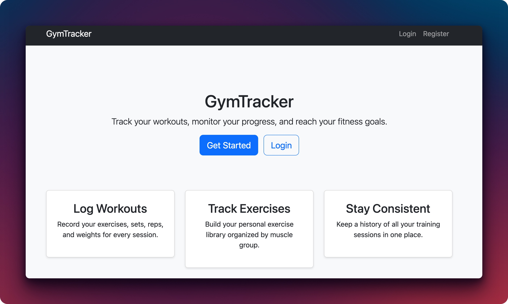
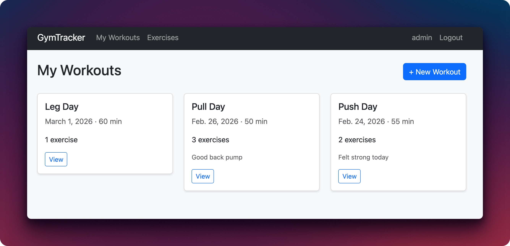
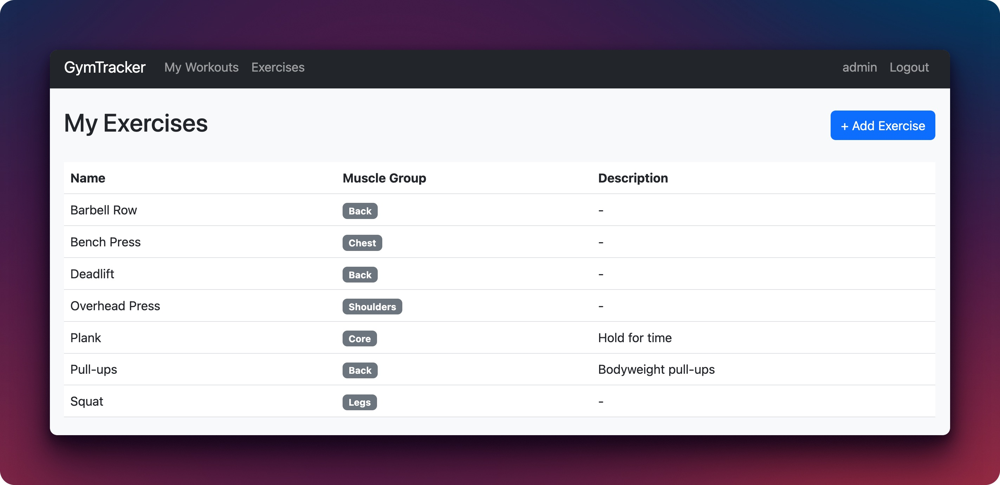
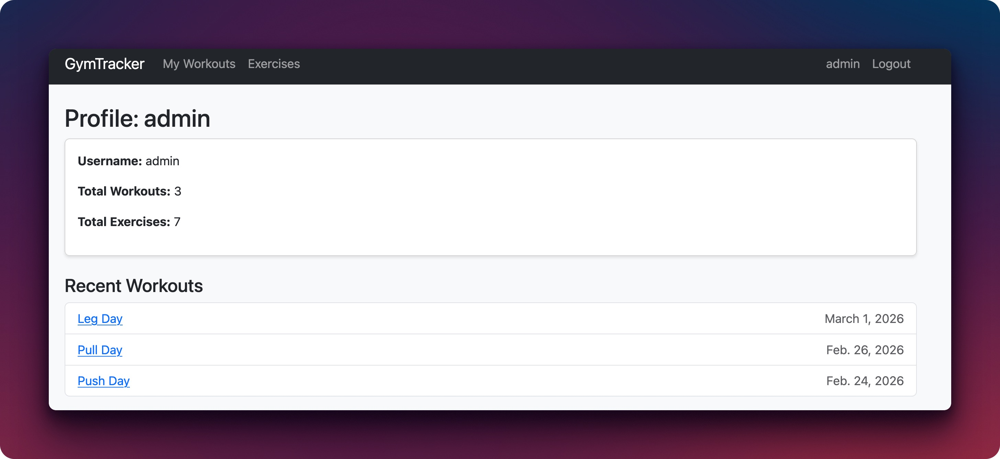

# GymTracker

A Django web app for logging gym workouts and exercises. Users can register, create workouts with dates and durations, then attach exercises with sets, reps, and weight to each one. There's also an exercise library organized by muscle group and a profile page.

Built for the DSCC coursework at Westminster International University in Tashkent.

## Tech Stack

- Python 3.12, Django 5.x
- PostgreSQL 16
- Nginx (reverse proxy)
- Gunicorn (WSGI server)
- Docker and Docker Compose
- GitHub Actions (CI/CD)
- AWS EC2 (deployment)

## Features

- User registration and login
- Create, edit, and delete workouts with exercises
- Track sets, reps, and weight per exercise
- Exercise library filtered by muscle group
- User profile page
- Django admin panel

## Local Setup

```bash
git clone https://github.com/BexTuychiev/dscc-coursework.git
cd dscc-coursework
python -m venv .venv
source .venv/bin/activate
pip install -r requirements.txt
python manage.py migrate
python manage.py createsuperuser
python manage.py runserver
```

The app runs at `http://localhost:8000`.

## Running with Docker

```bash
cp .env.example .env
# Edit .env with your values
docker compose up -d --build
```

Nginx serves the app at `http://localhost`. The Django container talks to PostgreSQL and Nginx proxies requests to Gunicorn on port 8000.

## Deployment

The app runs on an AWS EC2 instance with Ubuntu 24.04, Docker, and Docker Compose installed.

To deploy manually:

1. SSH into the server and clone the repo
2. Copy `.env.example` to `.env` and set production values (`DEBUG=False`, a real `SECRET_KEY`, correct `ALLOWED_HOSTS`)
3. Run `docker compose up -d`
4. Set up SSL with Certbot and Let's Encrypt

Pushing to `main` triggers the GitHub Actions pipeline, which lints the code, runs tests against a PostgreSQL service container, builds a Docker image, pushes it to DockerHub, and deploys to the server over SSH. The deploy step only recreates the web container while keeping the database and Nginx running, so there's no full downtime during releases.

## Environment Variables

Create a `.env` file from `.env.example`. Here's what each variable does:

| Variable | Description |
|---|---|
| `SECRET_KEY` | Django secret key for cryptographic signing |
| `DEBUG` | `True` for local dev, `False` in production |
| `ALLOWED_HOSTS` | Comma-separated hostnames the app responds to |
| `DB_ENGINE` | Database backend, use `django.db.backends.postgresql` |
| `DB_NAME` | PostgreSQL database name |
| `DB_USER` | PostgreSQL username |
| `DB_PASSWORD` | PostgreSQL password |
| `DB_HOST` | Database host (`db` when running in Docker) |
| `DB_PORT` | Database port, defaults to `5432` |

## Tests

```bash
pytest -v
```

8 tests covering model creation, view access control, workout CRUD, and user registration.

## Screenshots








